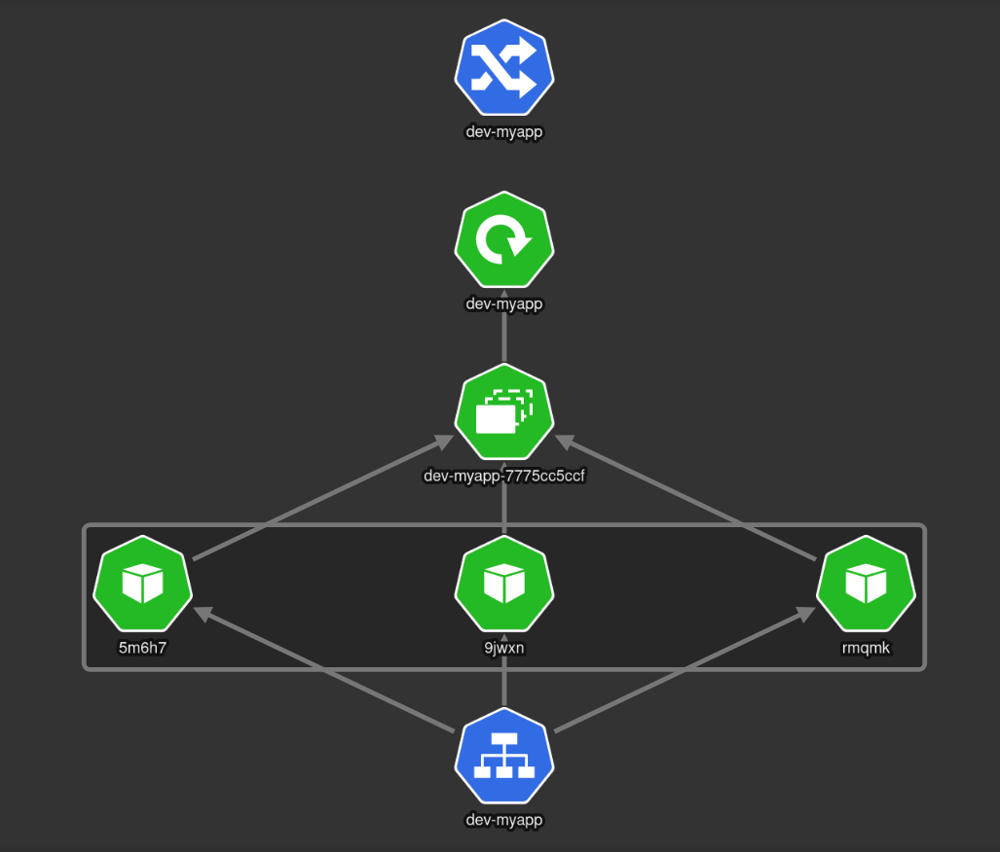

# service-example

Golang were used to deploy this application. Other components of the project include:
- GitHub
- GitHub Packages
- Docker
- Kubernetes
- Helm chart

The CI/CD pipeline includes these steps:
- Build Docker images and push it to the GitHub Packages.
- Use Trivy scanners that look for security issues.

## Using Docker

### Deploy Docker Containers
``` bash
git clone git@github.com:ashkaanh/service-example.git
cd app
docker compose up -d
```

### Test
Go to <http://<server-ip>:8080/> in your browser.

## Using Kubernetes
The helm chart can be used to deploy the application in a Kubernetes cluster. The follwoing kinds are deploy in k8s:



### Deploy Helm Chart
``` bash
git clone git@github.com:ashkaanh/service-example.git
cd /k8s/charts/myapp
kubectl create ns dev-myapp
helm install dev -n dev-myapp .
```

### Test
``` bash
kubectl port-forward -n dev-myapp service/dev-myapp 8080:8080
```
Go to <http://<server-ip>:8080/> in your browser or use the following command:
``` bash
curl -X 'GET' <server-ip>:8080 -H 'accept: application/json'
```